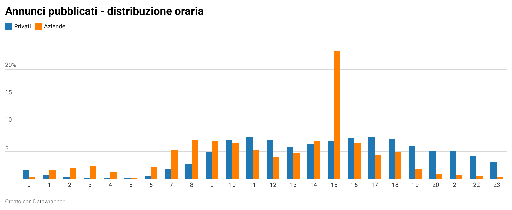
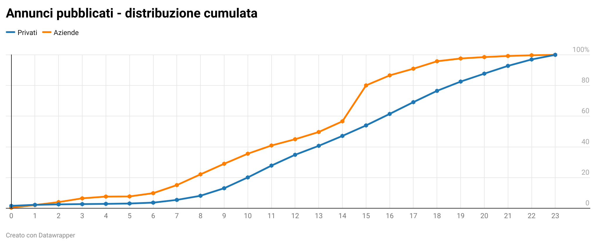

## Acquistare una bicicletta a Bologna

L'idea alla base di questa serie nasce come effetto collaterale del tentativo di acquistare una bicicletta a Bologna. Essendo uno degli oggetti più rubati in città ho cercato, invano, di acquistarne una di seconda mano ad un prezzo ragionevole, arrivando a constatare quanto sia difficile, fino ad accantonare l'idea. 

La "difficoltà" non è dovuta al mercato poco attivo, tutt'altro. La difficoltà principale è quella di riuscire a contattare un venditore come primo acquirente, nonostante l'articolo sia stato pubblicato solo qualche ora prima. 

Questa esperienza mi ha fatto sorgere alcune domande:
* dopo quanto tempo un articolo risulta non più disponibile?
* esiste un momento del giorno, o periodo dell'anno, migliore per cercare un articolo?
* ci sono ciclicità nei movimenti di domanda e offerta del mercato dell'usato?
* quali sono gli articoli maggiormente scambiati e come sono distribuiti sul territorio?
* è possibile determinare in anticipo il miglior prezzo d'acquisto e identificare gli annunci migliori?   

## Dalla raccolta dati ai primi analytics

Avendo definito lo scopo mi sono occupato inizialmente di raccogliere i dati su cui poter lavorare e reperire le informazioni direttamente dagli annunci trovati in rete, costruendo di un semplice tool che facesse il lavoro per me e che giornalmente controllasse gli annunci pubblicati aggiornando quelli già processati.

Il perimetro disponibile ad oggi nonostante sia molto ricco, non ci permette ancora di identificare ciclicità di medio periodo, ma è ampiamente sufficiente per avere una vista macro del mercato che stiamo osservando.

##### PERIMETRO E DATI DISPONIBILI

Ad oggi è possibile analizzare circa 215.000 annunci, pubblicati da Novembre in poi nella provincia di Bologna, da arricchire con un ulteriore set relativo al solo mercato immobiliare, in fase di consolidamento.
Possiamo distinguere principalmente quattro categorie: _immobili_, _usato_, _servizi_, _veicoli_.

La tabella rappresenta la distribuzione degli articoli divisi tra le categorie, mostrando che **solo il 27% degli annunci pubblicati rappresentano il 98% del valore economico complessivo**, concentrandosi principalmente tra veicoli e immobili.  
Essendo mercati molto diversi li andremo ad osservare dividendoli in tre gruppi:

* occasioni di seconda mano (usato, veicoli);
* immobili;
* servizi.

##### TREND DI PUBBLICAZIONE DEGLI ANNUNCI

Le statistiche viste in precedenza ci indicano chiaramente quanto il mercato da esplorare sia ricco e vivo, quindi la prima domanda a cui proviamo a rispondere è: **quanti annunci vengono pubblicati in una settimana?**

Dal grafico si nota che settimanalmente vengono pubblicati circa 19.000 annunci, con una media di oltre 2.700 al giorno. 

È curioso notare come il periodo natalizio abbia indotto una riduzione di circa 7.000 annunci, per poi riprendere con un incremento del 10% rispetto alla media del periodo precedente. Questo fenomeno è riconducibile all'inattività degli utenti privati e dalle interruzioni delle attività lavorative delle società.

Osservando sempre più nel dettaglio anche all'interno della giorno sono presenti dei momenti in cui è presente una concentrazione maggiore degli annunci presenti in rete. 

Il .... comportamento è dovuto principalmente dal tipo di utenti presenti sul mercato, ovvero **aziende** e **privati**. Questa distinzione ci fa notare per osservare più del 80% degli annunci pubblicati dalle aziende ci basterà aspettare le 15, mentre per gli utenti privati sarà necessario aspettare le 19. 

**Questo ci dovrebbe aiutare a individuare il momento migliore della giornata entro cui osservare gli annunci pubblicati.**

I segmenti di mercato e le tipologie di clienti  individuati ci potrebbe far pensare che ci sia qualche ... . Si nota infatti che **tra il 75% e 85% degli annunci di immobili e veicoli vengono pubblicati dalle aziende** che sfruttano questo canale per pubblicizzare i propri prodotti, mentre **più del 80% dei prodotti del mercato dell'usato** è scambiato tra utenti privati.

Avere due tipi di inserzionisti presenta delle ripercussioni sulle fasce di prezzo dei prodotti pubblicizzati comportando una variazione di **+40% sugli appartamenti** e **+120% sulle auto**. Questo è giustificato dai margini di vendita delle aziende, dalla migliore qualità dei prodotti venduti e dalla coerenza tra prezzo indicato e valore il di mercato.

<<Perchè fare attenzione al tipo di utente che pubblica?>>

Con queste prime evidenze, che verranno approfondite e analizzare nei prossimi articoli, si conclude il pilota di questa serie.