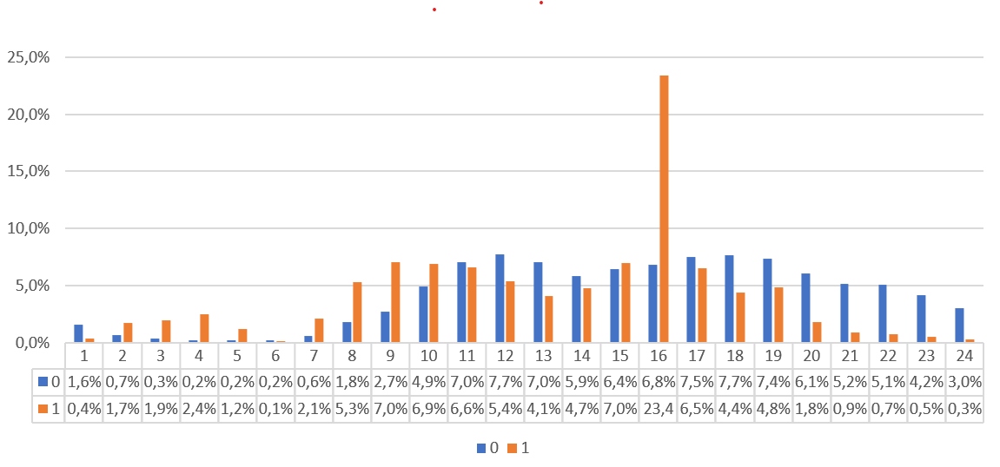

## Acquistare una bicicletta a Bologna

L'idea alla base di questo blog e della realizzazione questa serie nasce dalla grande difficoltà riscontrata a compiere un'azione semplicissima: **acquistare una bicicletta a Bologna**.

Essendo uno degli oggetti più rubati in città l'obiettivo è sempre stato quello di acquistarne una di seconda mano, arrivando a constatare che **è molto difficile acquistare una bicicletta a Bologna di seconda mano**. 

La "difficoltà" non è dettata da un mercato poco attivo, tutt'altro. La difficoltà principale è quella di riuscire a contattare un venditore come primo acquirente, nonostante l'articolo sia stato pubblicato solo da poche ore. 

Con questa esperienza mi sono posto alcune domande:
* esiste un momento del giorno, o periodo dell'anno, migliore per cercare un articolo?
* ci sono ciclicità nei movimenti di domanda e offerta del mercato dell'usato?
* dopo quanto tempo un annuncio risulta non più disponibile?
* quali sono gli articoli maggiormente scambiati e come sono distribuiti sul territorio?
* è possibile determinare in anticipo il miglior prezzo d'acquisto e identificare i prodotti migliori?   

## Dalla raccolta dati ai primi analytics

Definito lo scopo è stato necessario raccogliere i dati su cui poter lavorare, ovvero reperire le informazioni dagli annunci. 

Con la costruzione di un semplice tool che facesse il lavoro per me, giornalmente è stato possibile controllare tutti gli annunci pubblicati.

Il perimetro disponibile ad oggi nonostante sia molto ricco, non ci permette ancora di identificare ciclicità di medio periodo, ma è ampiamente sufficiente per identificare degli insight sul mercato che stiamo osservando.

##### PERIMETRO E DATI DISPONIBILI

Ad oggi è possibile analizzare circa xxx.000 annunci pubblicati da Novembre in poi nella provincia di Bologna, da arricchire con un ulteriore set relativo al solo mercato immobiliare, ancora in via di definizione.
Possiamo distinguere 4 categorie di prodotti: _immobili_, _usato_, _servizi_, _veicoli_.

|Segmento   | Annunci     | Valore      |
|:---------:|:-----------:|:-----------:|
|Immobili   |2.265 (2%)   |501Mln (38%) |
|Usato      |68.386  (52%)|24,3Mln (2%) |
|Servizi    |4.489  (3%)  |5,8Mln (0%)  |
|Veicoli    |57.051 (43%) |789Mln (60%) |
|**TOTALE** |**132.191**| **1,321Mld**  |

Dalla distribuzione si vede chiaramente che **il 45% pubblicati rappresentano il 98% del valore economico complessivo**.  

Essendo mercati molto diversi, proveremo ad analizzarli separatamente aggregandoli in tre sezioni:

* occasioni di seconda mano (usato, veicoli);
* immobili;
* servizi.

##### TREND DI PUBBLICAZIONE DEGLI ANNUNCI

Le statistiche viste in precedenza ci indicano chiaramente quanto il mercato da esplorare sia ricco e vivo. La prima domanda, quindi, a cui proviamo a rispondere è: **quanti annunci vengono pubblicati in una settimana?**

Dal grafico vediamo chiaramente che settimanalmente vengono inserivi circa XXX mila annunci, con una media di XXX mila per giorno. 

È curioso notare come il periodo natalizio ha indotto una riduzione di circa XXX mila annunci, per poi riprendere con un incremento del XXX%. 
Questo fenomeno chiaramente riconducibile all'inattività degli utenti privati e dalle interruzioni delle attività lavorative delle società.

Osservando sempre più nel dettaglio anche all'interno della giorno sono presenti delle fasce orarie in cui è presente una concentrazione maggiore degli annunci pubblicati. 

Questo è frutto principalmente dall'autore dell'annuncio: per le azienda l'80% degli annunci totali vengono pubblicati entro e non oltre le 16. Osservando invece gli annunci degli utenti privati bisognerà aspettare fino alle 20 per poter scorrere almeno l'80% degli annunci totali. 

**Questo ci aiuta a individuare il momento migliore della giornata entro cui osservare gli annunci per avere un quadro completo di tutti a disposizione.**

Questa tipologia di utenti così ripartita ci fa pensare che alcune categorie di prodotto potrebbero essere prerogativa di una delle due categorie. Si nota infatti che **tra il 75% e 85% degli annunci di immobili e veicoli vengono pubblicati dalle aziende**. Queste categorie di annunci risultano delle vere e campagne di marketing.

Avere due tipi di inserzionisti presenta delle ripercussioni sulle fasce di prezzo dei prodotti pubblicizzati che variano ad esempio **con un +40% sugli appartamenti e un +120% sulle auto**. Questo è giustificato dalla necessità per le aziende di realizzazione dei margini di vendita, dalla migliore qualità del prodotto venduto e alla coerenza del prezzo indicato con valore il di mercato del prodotto.

Si conclude quindi il pilota di questa serie, dove sono state raccolte **solo le prime evidenze del mercato che vorremmo analizzare** nei prossimi articoli.