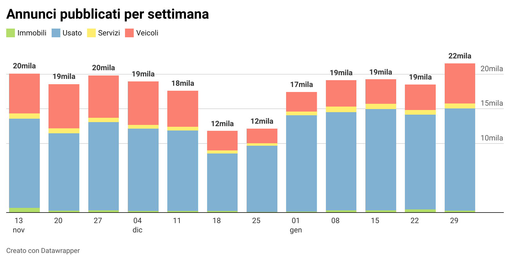

## Acquistare una bici a Bologna

L'idea alla base di questo blog e della realizzazione questa serie nasce da un esigenza che come me penso chiunque abiti o abbia abitato a Bologna ha sentito: **acquistare una bicicletta**. 

Un'altra cosa ben nota per chi vive a Bologna è che le biciclette sono come gli ombrelli, se ti distrai per qualche minuto rischi di non ritrovarla più. 
Quindi prima di pensare di acquistare una bicicletta nuova fiammante ho cercato di capire se fosse possibile acquistarne una di seconda mano. 

Con questa convinzione ho iniziato la ricerca del mio futuro bolide, ma in pochissimo tempo mi sono scontrato con una grande certezza: **è molto difficile acquistare una bicicletta a Bologna di seconda mano**. 

La _difficoltà_ nell'acquisto non è dovuta alla carenza del prodotto o a un mercato poco attivo, tutt'altro. La difficoltà è quella di riuscire a contattare un venditore come primo acquirente, anche se l'articolo è stato pubblicato solo da poche ore. 

Da questa esperienza mi sono posto alcune domande, come ad esempio:
* esiste un momento migliore del giorno o periodo dell'anno per cercare una bicicletta?
* ci sono ciclicità nei movimenti di domanda e offerta del mercato dell'usato?
* dopo quanto tempo un annuncio risulta non più disponibile?
* generalizzando questo concetto, quali sono gli articoli maggiormente scambiati e come sono distribuiti sul territorio?
* è possibile determinare in anticipo il miglior prezzo d'acquisto e identificare i prodotti migliori?   

## Dalla raccolta dati ai primi analytics

Avevo quindi definito lo scopo ma non avevo a disposizione una base su cui lavorare, quindi ho docuto reperire i dati sugli annunci. 

Ho realizzato così un semplice tool che facesse il lavoro per me. Giornalmente si è occupato di controllare gli annunci e ne trovasse di nuovi li registrasse in un database.

Il perimetro disponibile ad oggi non ci permette ancora di identificare ciclicità sul medio periodo, ma ci permette di avere informazioni di base sul mercato che stiamo osservando.

##### PERIMETRO E DATI DISPONIBILI

Ad oggi il database contiene gli annunci pubblicati da Novembre in poi e conta al proprio interno più di 135.000 annunci, pubblicati all'interno della provincia di Bologna, per un valore complessivo di circa 3Mld di euro. La base dati è idealmente divisibile in 4 catgorie: _immobili_, _occasioni_, _servizi_, _veicoli_. 

Rispettivamente le quattro cateogorie sopra indicate si ripartiscono il mercato nel seguente modo:

|Segmento   | Annunci     | Valore      |
|:---------:|:-----------:|:-----------:|
|Immobili   |6.769 (5%)   |1,8Mld (69%) |
|Occasioni  |68.386  (50%)|24,3Mln (1%) |
|Servizi    |4.489  (3%)  |5,8Mln (0%)  |
|Veicoli    |57.051 (42%) |789Mln (30%) |
|**TOTALE** |**136.695**| **2,659Mld**  |

Da questa prima rappresentazione emerge che circa il 47% pubblicati rappresentano il 99% del valore economico del mercato dell'usato. 

Essendo un mercato molto particolare quello degli immobili condurremo l'analisi dividendola in due sezioni:

* mercato dell'usato (occasioni, servizi, veicoli);
* mercato degli immobili.

Per questa prima fase ci concentreremo sul mercato dell'usato.

##### TREND E PUBBLICAZIONE DEGLI ANNUNCI

---

* DIMESIONE DEL MERCATO ANALIZZATO
* PUBBLICAZIONE DEGLI ANNUNCI CON DIMENSIONI TEMPORALI

## OBIETTIVI: CERCARE ABITUDINI DI COMPORTAMENTO DEGLI UTENTI ATTIVI SUI MERCATI DELL'USATO. 

## A CHI TI RIVOLGI?
* ### PERSONE INTERESSATE A STUDI DI SETTORE
* ### CHIUNQUE PRENDA IN CONSIDERAZIONE UN ACQUISTO DI SECONDA MANO