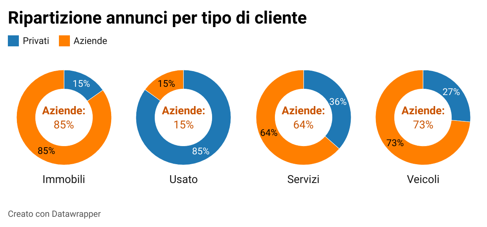

## Acquistare una bici a Bologna

L'idea alla base di questo blog e della realizzazione questa serie nasce da un esigenza che come me penso chiunque abiti o abbia abitato a Bologna ha sentito: **acquistare una bicicletta**. 

Un'altra cosa ben nota per chi vive a Bologna è che le biciclette sono come gli ombrelli, se ti distrai per qualche minuto rischi di non ritrovarla più. 
Quindi prima di pensare di acquistare una bicicletta nuova fiammante ho cercato di capire se fosse possibile acquistarne una di seconda mano. 

Con questa convinzione ho iniziato la ricerca del mio futuro bolide, ma in pochissimo tempo mi sono scontrato con una grande certezza: **è molto difficile acquistare una bicicletta a Bologna di seconda mano**. 

La _difficoltà_ nell'acquisto non è dovuta alla carenza del prodotto o a un mercato poco attivo, tutt'altro. La difficoltà è quella di riuscire a contattare un venditore come primo acquirente, anche se l'articolo è stato pubblicato solo da poche ore. 

Da questa esperienza mi sono posto alcune domande, come ad esempio:
* esiste un momento migliore del giorno o periodo dell'anno per cercare una bicicletta?
* ci sono ciclicità nei movimenti di domanda e offerta del mercato dell'usato?
* dopo quanto tempo un annuncio risulta non più disponibile?
* generalizzando questo concetto, quali sono gli articoli maggiormente scambiati e come sono distribuiti sul territorio?
* è possibile determinare in anticipo il miglior prezzo d'acquisto e identificare i prodotti migliori?   

## Dalla raccolta dati ai primi analytics

Avevo quindi definito lo scopo ma non avevo a disposizione una base su cui lavorare, quindi ho docuto reperire i dati sugli annunci. 

Ho realizzato così un semplice tool che facesse il lavoro per me. Giornalmente si è occupato di controllare gli annunci e ne trovasse di nuovi li registrasse in un database.

Il perimetro disponibile ad oggi non ci permette ancora di identificare ciclicità sul medio periodo, ma ci permette di avere informazioni di base sul mercato che stiamo osservando.

##### PERIMETRO E DATI DISPONIBILI

Ad oggi è possibile analizzare circa 132.000 annunci pubblicati da Novembre in poi nella provincia di Bologna. 
Complessivamente cubano circa 1,3Mld di euro e possiamo distinguere 4 macro catgorie: _immobili_, _usato_, _servizi_, _veicoli_.

|Segmento   | Annunci     | Valore      |
|:---------:|:-----------:|:-----------:|
|Immobili   |2.265 (2%)   |501Mln (38%) |
|Usato      |68.386  (52%)|24,3Mln (2%) |
|Servizi    |4.489  (3%)  |5,8Mln (0%)  |
|Veicoli    |57.051 (43%) |789Mln (60%) |
|**TOTALE** |**132.191**| **1,321Mld**  |

Si può notare quindi che il 45% pubblicati rappresentano il 98% del valore economico complessivo. 

Essendo quindi mercati molto diversi per loro natura proveremo a dividere in tre mercati le inserzioni, ovvero:

* occasioni di seconda mano (usato, veicoli);
* immobili;
* servizi.

##### TREND DI PUBBLICAZIONE DEGLI ANNUNCI

Già dai primi macro numeri è semplice capire quanto il mercato che vogliamo esplorare sia ricco e vivo e quindi la prima domanda: quanti annunci circolano mediamente al giorno?

Dal grafico infatti si vede che settimanalmente gli annunci pubblicati sono circa XXX mila, in media di XXX mila al giorno. 

--> distribuzione oraria

--> ripartizine degli annunci cumulata nel giorno per mostrare dopo che ora gran parte degli annunci sono stati già pubblicati
--> mostrare che per le auto si può aspettare 2 ore in meno in quanto gli annunci sono legati alle società che li pubblicano

È curioso notare come il periodo natalizio ha indotto una riduzione di circa XXX mila annunci, per poi riprendere con un incremento del XXX%. 
Questo fenomeno è spiegabile dall'inattività degli utenti privati e dalle interruzioni delle attività lavorative delle società.

I mercati analizzati si distinguono principalmente per il tipo utente che è possibile contattare. Infatti osservando gli annunci nel perimetro divisi per tipo di utente si può notare che le società pubblicano rispettivamente 75% e 85% degli annunci degli immobili e dei veicoli.

**--> far vedere che gran parte del mercato dell'auto e degli immobili è composto da annunci proposti da società**

--> mostrare lo scostamento dei prezzi per gli articoli venduti dalle società e dagli utenti privati
--> conclusioni e rimando al prossimo articolo

---

Per questa prima fase ci concentreremo sul mercato **delle occasioni di seconda mano**.

## OBIETTIVI: CERCARE ABITUDINI DI COMPORTAMENTO DEGLI UTENTI ATTIVI SUI MERCATI DELL'USATO. 

## A CHI TI RIVOLGI?
* ### PERSONE INTERESSATE A STUDI DI SETTORE
* ### CHIUNQUE PRENDA IN CONSIDERAZIONE UN ACQUISTO DI SECONDA MANO