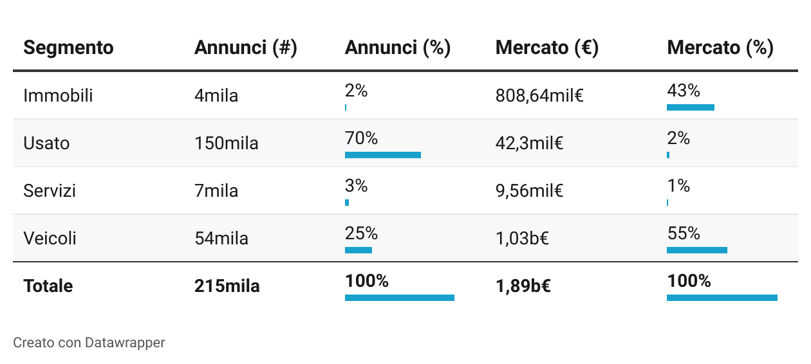

## Acquistare una bicicletta a Bologna

L'idea alla base di questa serie nasce come effetto collaterale del tentativo di acquistare una bicicletta a Bologna. Essendo uno degli oggetti più rubati in città ho cercato, invano, di acquistarne una di seconda mano ad un prezzo ragionevole, arrivando a constatare la difficoltà, fino ad accantonare l'idea. 

La "difficoltà" non è dovuta al mercato poco attivo, tutt'altro. La difficoltà principale è quella di riuscire a contattare un venditore come primo acquirente, nonostante l'articolo sia stato pubblicato solo qualche ora prima. 

Questa esperienza mi ha fatto sorgere alcune domande:
* qual è il prezzo corretto a cui poter acquistare una bicicletta?
* esiste un momento del giorno, o periodo dell'anno, migliore per cercare un articolo?
* ci sono ciclicità nei movimenti di domanda e offerta del mercato dell'usato?
* dopo quanto tempo un articolo risulta non più disponibile?
* quali sono gli articoli maggiormente scambiati e come sono distribuiti sul territorio?
* è possibile determinare in anticipo il miglior prezzo d'acquisto e identificare gli annunci migliori?   

##### Dalla raccolta dati ai primi analytics

Avendo definito lo scopo mi sono occupato inizialmente di raccogliere i dati su cui poter lavorare e reperire le informazioni direttamente dagli annunci trovati in rete, costruendo di un semplice tool che facesse il lavoro per me. Giornalmente questo tool si è occupato di controllare gli annunci pubblicati annotando quelli nuovi o aggiornando quelli già processati.

Il perimetro disponibile ad oggi, nonostante sia molto ricco, non ci permette ancora di identificare ciclicità di medio periodo, ma è ampiamente sufficiente per avere una vista macro del mercato che stiamo osservando.

##### Perimetro e dati disponibili

Ad oggi è possibile analizzare circa 215.000 annunci, pubblicati da Novembre in poi nella provincia di Bologna, da arricchire con un ulteriore set relativo al solo mercato immobiliare, in fase di consolidamento.
Possiamo distinguere principalmente quattro categorie: _immobili_, _usato_, _servizi_, _veicoli_.

La tabella che rappresenta la distribuzione degli articoli divisi tra le categorie; evidenzia come **solo il 27%** degli annunci pubblicati rappresentano il **98% del valore economico complessivo**, distribuendosi quasi equamente tra veicoli e immobili.  

Essendo mercati molto diversi li andremo ad osservare dividendoli in tre gruppi:

* occasioni di seconda mano (usato, veicoli);
* immobili;
* servizi.

##### Trend di pubblicazione degli annunci

Le statistiche viste in precedenza ci indicano chiaramente quanto il mercato da esplorare sia ricco e vivo, quindi la prima domanda a cui proviamo a rispondere è: **quanti annunci vengono pubblicati in una settimana?**

Dal grafico si può vedere che settimanalmente vengono pubblicati circa 19.000 annunci, con una media di oltre 2.700 al giorno. 

È curioso notare come il periodo natalizio abbia indotto una riduzione di circa 7.000 annunci, per poi riprendere con un incremento del 10% rispetto alla media del periodo precedente. Questo fenomeno è riconducibile all'inattività degli utenti e alle interruzioni delle attività lavorative.

Osservando sempre più nel dettaglio, anche all'interno dei singoli giorni sono presenti delle fasce orarie in cui è presente una concentrazione maggiore degli annunci pubblicati. 

Le fasce orarie occupate dipendono dall'autore dell'annuncio. Possiamo vedere come le **aziende** occupino principalmente le fasce orarie dal mattino, dalle le 6 e le 18, pubblicando più del 80% dei loro annunci entro le 15. Gli annunci degli utenti **privati** sono distribuiti più omogeneamente durante la giornata, venendo pubblicati fino a tarda sera e  concentrandosi principalmente tra le 9 e le 20. 

Se proviamo inoltre a mettere in relazione il tipo di utente e il segmento di mercato si nota come alcuni mercati sono prerogativa di solo un tipo di utente:

Si vede infatti che tra il **75% e 85%** degli annunci di **immobili e veicoli** vengono pubblicati dalle aziende, mentre **più del 80%** dei prodotti del **mercato dell'usato** è scambiato tra utenti privati.

##### Perché fare attenzione all'utente che pubblica l'annuncio?

La risposta è abbastanza scontata: **per ottenere il prezzo migliore**. Infatti è facile immaginare come l'annuncio di un'azienda o di un privato possa portare ad avere dei prezzi diversi sulla stessa categoria di prodotti. 
Dal grafico successivo si vede bene questa differenza, con delle variazioni di ben oltre il 50% sui prezzi medi ad esempio di auto e immobili.

I prezzi diversi possono essere giustificati dai diversi margini di profitto, dalla migliore qualità dei prodotti venduti dalle aziende e soprattutto dal valore attribuito al prodotto rispetto reale valore il di mercato.

Con queste evidenze si chiude il pilota di questa serie lasciando qualche indizio utile su come scegliere gli annunci migliori presenti sul mercato.